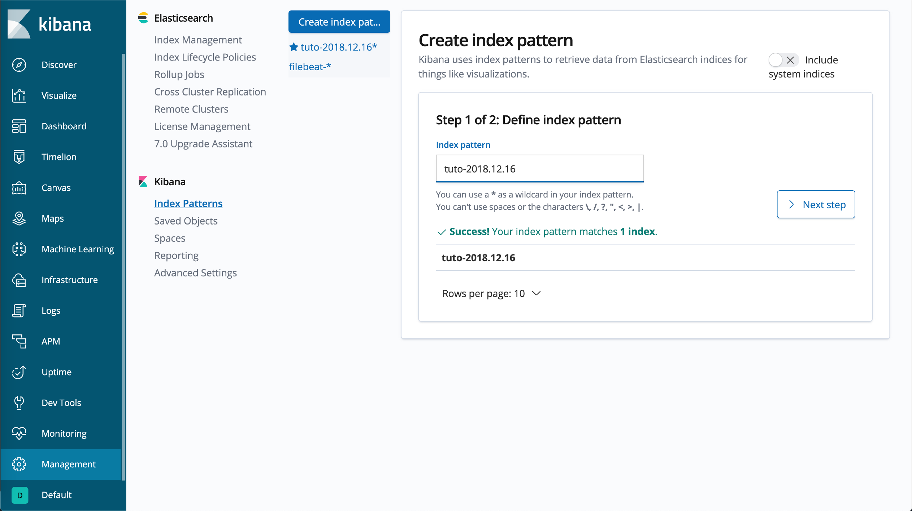
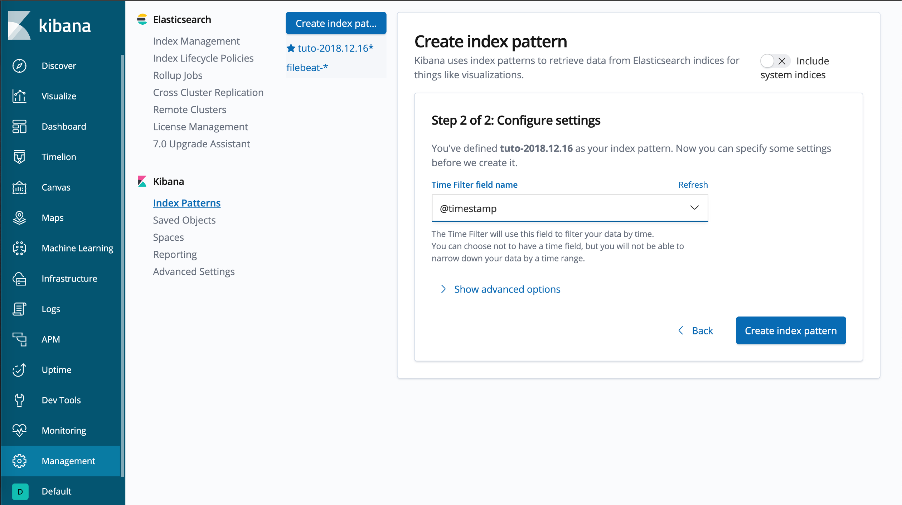
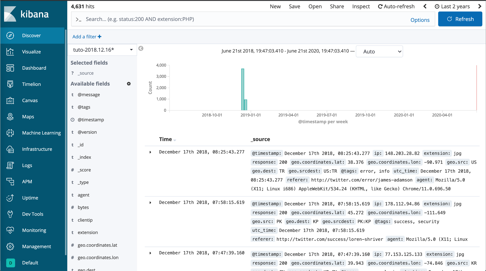

# Elastic Stack Tutorial
엘라스틱 스택 튜토리얼

## Product 별 버전
* CentOS 7.x
* [Elasticsearch 6.7.0](https://artifacts.elastic.co/downloads/elasticsearch/elasticsearch-6.7.0.tar.gz)
* [Logstash 6.7.0](https://artifacts.elastic.co/downloads/logstash/logstash-6.7.0.tar.gz)
* [Kibana 6.7.0](https://artifacts.elastic.co/downloads/kibana/kibana-6.7.0-x86_64.tar.gz)
* [Filebeat 6.7.0](https://artifacts.elastic.co/downloads/beats/filebeat/filebeat-6.7.0-x86_64.tar.gz)

최신 버전은 [Elasticsearch 공식 홈페이지](https://www.elastic.co/downloads)에서 다운로드 가능합니다.

## ELK Tutorial 준비
```bash
[ec2-user@ip-xxx-xxx-xxx-xxx ~]$ sudo yum -y install git

[ec2-user@ip-xxx-xxx-xxx-xxx ~]$ git clone https://github.com/yoonje/elastic-stack-tutorial.git

[ec2-user@ip-xxx-xxx-xxx-xxx ~]$ cd elastic-stack-tutorial

[ec2-user@ip-xxx-xxx-xxx-xxx elastic-stack-tutorial]$ sh tuto
##################### Menu ##############
 $ sh tuto [Command]
#####################%%%%%%##############
         1 : install elk packages
         2 : set elk
         3 : standard input/output, no filters
#########################################
```

## tuto 1~2 - Elasticsearch, Kibana, Filebeat 세팅

```bash
[ec2-user@ip-xxx-xxx-xxx-xxx elastic-stack-tutorial]$ sh tuto 1

[ec2-user@ip-xxx-xxx-xxx-xxx elasticsearch-head]$ /home/ec2-user/elastic-stack-tutorial

[ec2-user@ip-xxx-xxx-xxx-xxx elastic-stack-tutorial]$ sh tuto 2
```

#### Elasticsearch
* packages/elasticsearch/config/elasticsearch.yml
  - network.host, http.cors.enabled, http.cors.allow-origin 만 설정

* packages/elasticsearch/config/jvm.options
  - Xms1g, Xmx1g 를 물리 메모리의 절반으로 수정

```bash
[ec2-user@ip-xxx-xxx-xxx-xxx elastic-stack-tutorial]$ vi packages/elasticsearch/config/elasticsearch.yml
network.host: 0.0.0.0
http.cors.enabled: true
http.cors.allow-origin: "*"

[ec2-user@ip-xxx-xxx-xxx-xxx elastic-stack-tutorial]$ vi packages/elasticsearch/config/jvm.options
-Xms4g
-Xmx4g
```

* Head 플러그인 설치

#### Kibana
* packages/kibana/config/kibana.yml
  - server.host: "0.0.0.0" -> 외부에서 접근 가능하도록 변경
  - elasticsearch.url: "http://localhost:9200" -> 주석해제
  - kibana.index: ".kibana" -> 주석해제

```bash
[ec2-user@ip-xxx-xxx-xxx-xxx elastic-stack-tutorial]$ vi packages/kibana/config/kibana.yml
server.host: "0.0.0.0"
elasticsearch.url: "http://localhost:9200"
kibana.index: ".kibana"
```

#### Filebeat
* packages/filebeat/config/filebeat.yml
  - /home/ec2-user/elastic-stack-tutorial/sample/ 밑에 .log 파일을 스트리밍 하도록 추가
  - output.elasticsearch: 에 hosts: ["localhost:9200"] 추가

```bash
[ec2-user@ip-xxx-xxx-xxx-xxx elastic-stack-tutorial]$ vi packages/filebeat/config/filebeat.yml
filebeat.inputs:
- type: log
  enabled: true
  paths:
    - /home/ec2-user/elastic-stack-tutorial/sample/*.log
output.elasticsearch:
  hosts: ["localhost:9200"]
```

#### Smoke Test

##### Elasticsearch
* ElasticSearch 반응 확인
```bash
[ec2-user@ip-xxx-xxx-xxx-xxx elastic-stack-tutorial]$ curl localhost:9200
{
  "name" : "KSP-DCP",
  "cluster_name" : "elasticsearch",
  "cluster_uuid" : "rR30tBrtTl6LDq4nkzapxA",
  "version" : {
    "number" : "6.7.0",
    "build_flavor" : "default",
    "build_type" : "tar",
    "build_hash" : "8453f77",
    "build_date" : "2019-03-21T15:32:29.844721Z",
    "build_snapshot" : false,
    "lucene_version" : "7.7.0",
    "minimum_wire_compatibility_version" : "5.6.0",
    "minimum_index_compatibility_version" : "5.0.0"
  },
  "tagline" : "You Know, for Search"
}

$ curl -H 'Content-Type: application/json' -XPOST localhost:9200/firstindex/_doc -d '{ "mykey": "myvalue" }'
```

* HEAD 확인, Web Browser에 http://{IP}:9200


##### Kibana
* Web Browser에 http://{IP}:5601


##### Filebeat
* Process 확인 및 Elasticsearch에 filebeat 인덱스 생성 여부 확인
  - http://{IP}:9100/index.html?base_uri=http://{IP}:9200


## tuto 3 - standard input을 logstash가 받아 standard output으로 출력
packages/logstash/bin/logstash -e 'input { stdin { } } output { stdout {} }'

```bash
[ec2-user@ip-xxx-xxx-xxx-xxx elastic-stack-tutorial]$ sh tuto 3
[2019-03-31T14:07:08,465][INFO ][logstash.agent           ] Successfully started Logstash API endpoint {:port=>9600}
Hello benjamin
/home/ec2-user/ES-Tutorial-ELK/packages/logstash-6.7.0/vendor/bundle/jruby/2.5.0/gems/awesome_print-1.7.0/lib/awesome_print/formatters/base_formatter.rb:31: warning: constant ::Fixnum is deprecated
{
    "@timestamp" => 2019-03-31T14:27:30.761Z,
      "@version" => "1",
       "message" => "Hello benjamin",
          "host" => "ip-172-31-0-154.ap-southeast-1.compute.internal"
}
```
정상적으로 시작되었으면 Hello benjamin 이라고 텍스트를 입력

ctrl+c 로 sh tuto 3 중단

## ELK Tutorial - Kibana 활용
키바나 인덱스 패턴 만들기


Kibana Management 메뉴 선택


Kibana Index Patterns 선택 후 인덱스 이름 설정(logstash-\*)


timestamp 설정 후 인덱스 패턴 생성


Kibana Discovery 에서 해당 패턴으로 문서 확인
